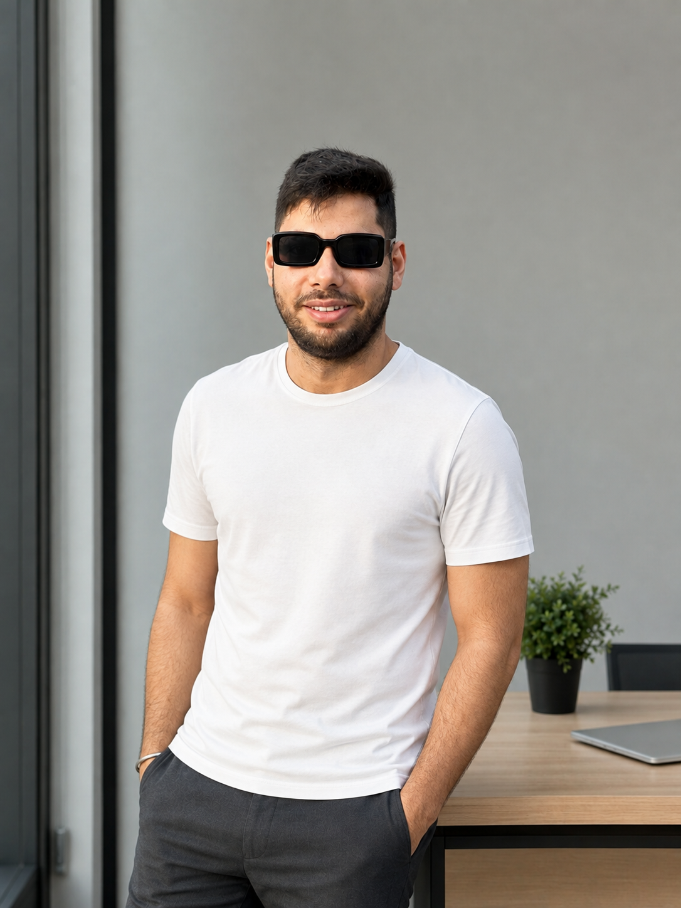

{width=250px}

Hi! I’m Rajat Vig, a Master of Data Science in Computational Linguistics student at UBC. Originally from India, I moved to Ontario, where I worked as a Full Stack Developer before starting the MDSCL program. I’m now looking to build on my software development background and explore opportunities in Machine Learning Engineering and AI Research. I’m excited to learn, experiment, and apply data science to solve interesting problems.
