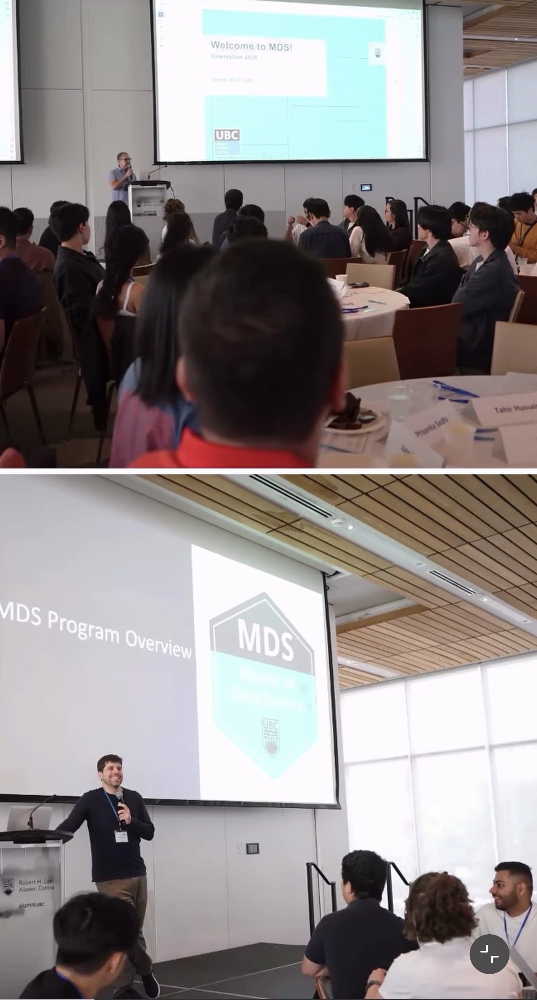

Starting the MDSCL program at UBC has been an exciting new chapter for me. Orientation was a great opportunity to meet my classmates, learn more about the program, and get a sense of what the next year will look like. Coming from a software development background, I’m looking forward to bringing my previous experience into this new environment.

My first classes have been a mix of challenging and interesting. One thing that surprised me was how quickly we were introduced to new concepts and how much collaboration and hands-on learning is involved. It has been a good reminder that there is always more to learn, even with a background in technology.

Now that I’ve started settling into the program, I’m feeling excited and motivated about what’s ahead. I’m looking forward to strengthening my skills in data science, machine learning, and computational linguistics while working on interesting projects with my classmates. I’m especially excited to see how the program shapes my path toward ML Engineering and AI Research.

